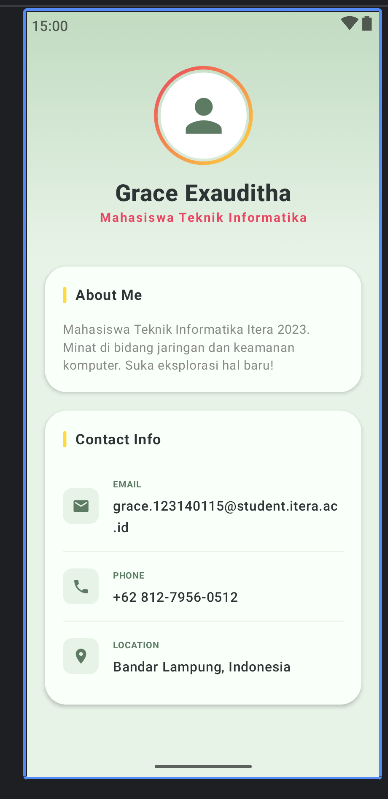

# Tugas 3 - Pengembangan Aplikasi Mobile

Aplikasi profil sederhana yang dibangun menggunakan **Jetpack Compose** dengan tema UI yang cerah (Light Mode) menggunakan palet warna Sage Green, Soft Yellow, dan Hot Pink.

## Fitur & Komponen
Aplikasi ini memenuhi kriteria tugas sebagai berikut:

### 1. Halaman Profil
* **Header**: Menampilkan foto profil (placeholder icon) dalam bentuk circular dengan border gradient.
* **Bio**: Deskripsi singkat mengenai latar belakang mahasiswa.
* **Informasi Kontak**: List yang berisi Email, Phone, dan Location.

### 2. Composable Functions (Reusable)
* `ProfileHeader`: Menangani tampilan foto, nama, dan role.
* `InfoItem`: Komponen baris untuk menampilkan ikon dan detail informasi kontak.
* `ProfileCard`: Kontainer berbasis `Card` untuk mengelompokkan konten dengan desain yang konsisten.

### 3. Layout & UI Elements
* **Layout**: `Column`, `Row`, `Box`.
* **Components**: `Card`, `Text`, `HorizontalDivider`.
* **Media**: `Icon` (Material Design Icons).
* **Styling**: Menggunakan `Brush` untuk gradient dan `RoundedCornerShape` untuk estetika UI.

## Screenshot UI
## Screenshot UI

