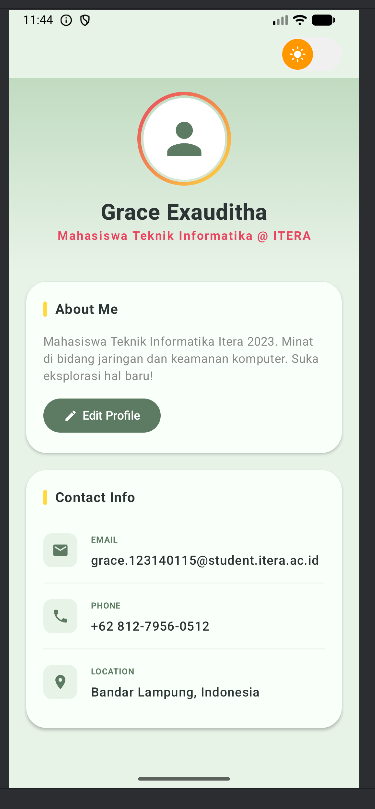
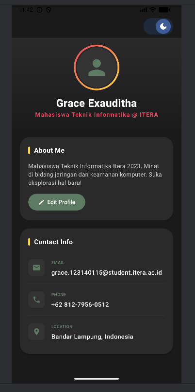
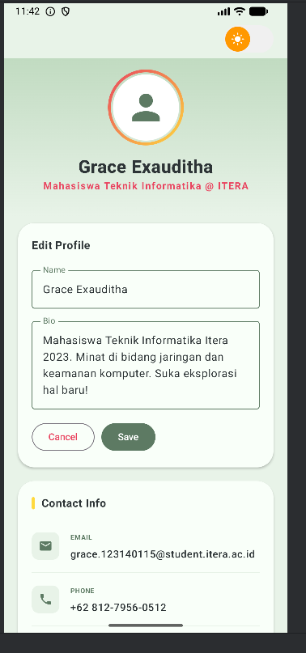
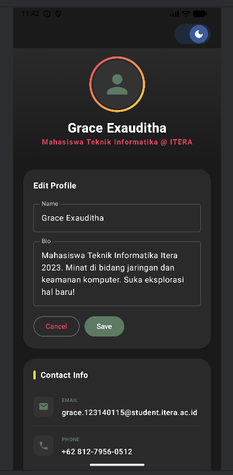

# Tugas 4 - MVVM Profile App
**Nama:** Grace Exauditha  
**NIM:** 123140115  
**Mata Kuliah:** Pemrograman Aplikasi Mobile

---

## 📱 Deskripsi Tugas
Pengembangan Profile App dari minggu lalu dengan mengimplementasikan MVVM Pattern, fitur Edit Profile, dan Dark Mode Toggle.

---

## ✨ Fitur yang Diimplementasikan

### 1. MVVM Pattern
- `ProfileViewModel` dengan `StateFlow` untuk manajemen state
- `ProfileUiState` sebagai data class yang merepresentasikan UI state

### 2. Edit Profile
- Form untuk edit nama dan bio
- State hoisting pada `TextField` (stateless component)
- Save button yang mengupdate ViewModel

### 3. Dark Mode Toggle
- Custom toggle dengan animasi smooth (ikon matahari/bulan)
- State dark mode disimpan di ViewModel

---

## 🗂️ Struktur Folder
```
4_123140115/
└── app/src/main/java/com/example/myprofileapp/
    ├── data/
    │   └── ProfileUiState.kt
    ├── ui/
    │   ├── ProfileScreen.kt
    │   └── theme/
    │       ├── Color.kt
    │       ├── Theme.kt
    │       └── Type.kt
    ├── viewmodel/
    │   └── ProfileViewModel.kt
    └── MainActivity.kt
```

---

## 📸 Screenshot

### Light Mode


### Dark Mode


### Edit Profile - Light Mode


### Edit Profile - Dark Mode


---

## 🛠️ Tech Stack
- **Language:** Kotlin
- **UI Framework:** Jetpack Compose
- **Architecture:** MVVM (Model-View-ViewModel)
- **State Management:** StateFlow + collectAsStateWithLifecycle
- **Min SDK:** 24
- **Target SDK:** 36
