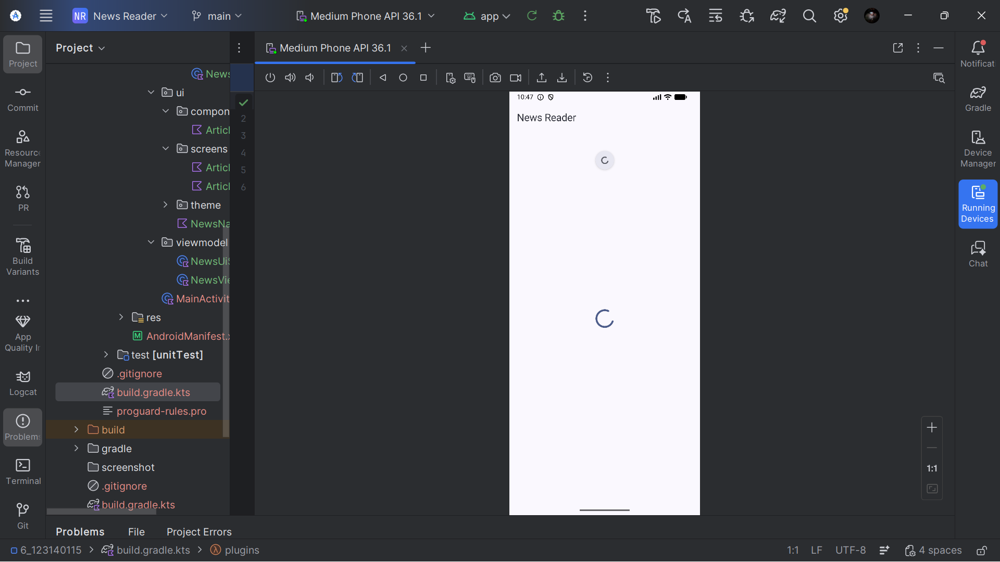
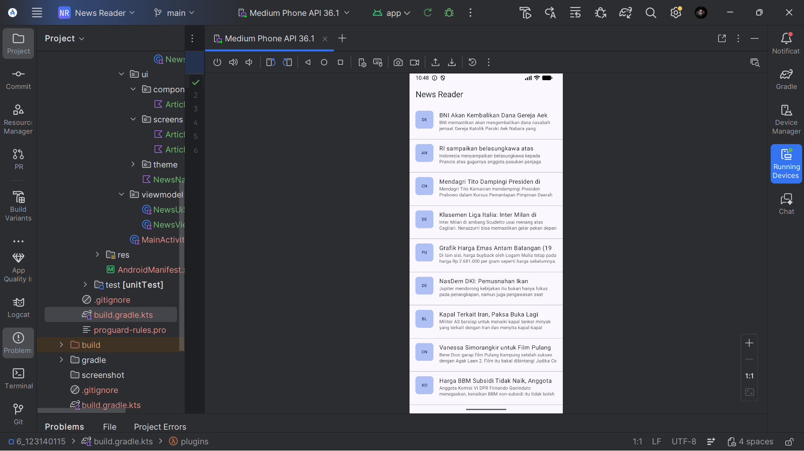
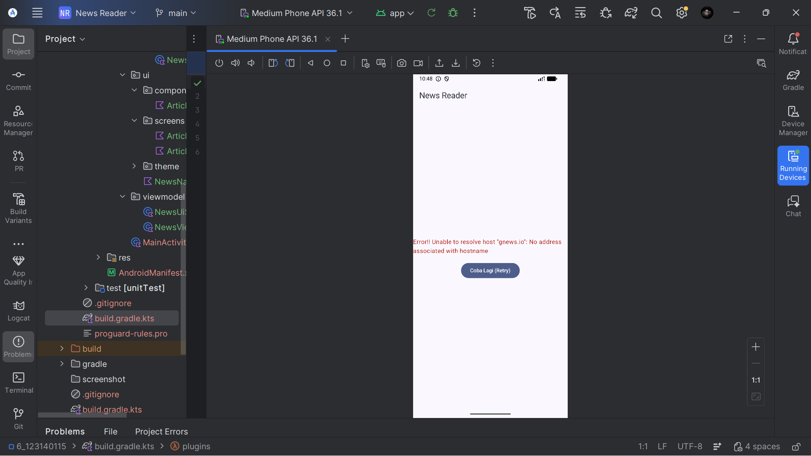
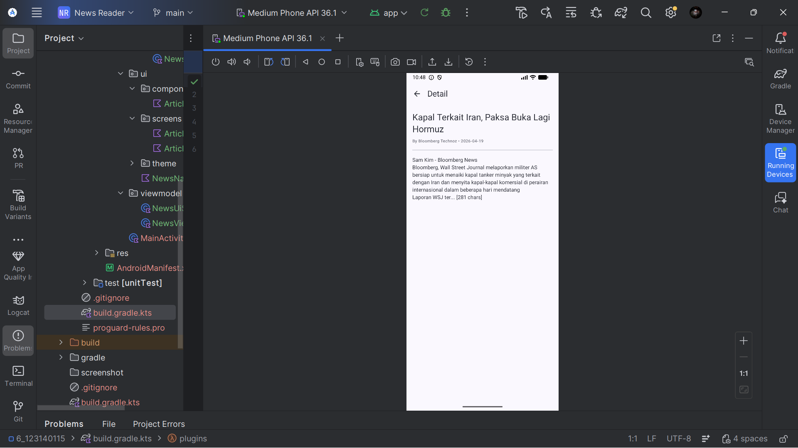

# 📰 News Reader App
**Tugas Praktikum Minggu 6 — Pengembangan Aplikasi Mobile**

Aplikasi Android News Reader yang mengambil berita dari public API menggunakan arsitektur modern Android development.

---

## 🛠️ Tech Stack

- **Bahasa:** Kotlin
- **UI:** Jetpack Compose + Material3
- **Networking:** Ktor Client
- **Serialization:** Kotlinx Serialization
- **Architecture:** MVVM + Repository Pattern
- **Navigation:** Navigation Compose
- **API:** [GNews API](https://gnews.io)

---

## 🌐 API yang Digunakan

| Item | Detail |
|------|--------|
| Provider | GNews API |
| Endpoint | `https://gnews.io/api/v4/top-headlines` |
| Parameter | `category=general`, `lang=id`, `country=id` |
| Auth | API Key via `BuildConfig` (disimpan di `local.properties`) |

---

## ✨ Fitur

- ✅ Fetch berita dari GNews API
- ✅ Tampilkan list artikel dengan title dan description
- ✅ Detail screen saat artikel di-klik
- ✅ Pull to refresh functionality
- ✅ Loading, Success, dan Error states
- ✅ Repository pattern untuk API calls

---

## 🏗️ Arsitektur

```
app/
├── data/
│   ├── api/
│   │   └── NewsApiService.kt       # Ktor HTTP client & API calls
│   ├── model/
│   │   └── Article.kt              # Data class + NewsResponse wrapper
│   └── repository/
│       └── NewsRepository.kt       # Repository pattern
├── ui/
│   ├── components/
│   │   └── ArticleItem.kt          # Reusable composable
│   └── screens/
│       ├── ArticleListScreen.kt    # List screen + pull to refresh
│       └── ArticleDetailScreen.kt  # Detail screen
├── viewmodel/
│   ├── NewsViewModel.kt            # ViewModel + state management
│   └── NewsUiState.kt              # Sealed class UI states
└── MainActivity.kt
```

---

## 📸 Screenshots & Video

### Link Video
[Link Demo](https://youtu.be/PrMN4AbUEjA)

### Loading State


### Success State


### Error State


### Detail Screen


---

## ▶️ Cara Menjalankan

1. Clone repository ini
2. Buka project di Android Studio
3. Tambahkan API key di `local.properties`:
   ```
   NEWS_API_KEY=your_gnews_api_key_here
   ```
4. Sync Gradle
5. Run aplikasi

> 🔑 Daftar API key gratis di [gnews.io](https://gnews.io)

---

## 📦 Dependencies

```kotlin
// Ktor Networking
implementation("io.ktor:ktor-client-core:2.3.7")
implementation("io.ktor:ktor-client-android:2.3.7")
implementation("io.ktor:ktor-client-content-negotiation:2.3.7")
implementation("io.ktor:ktor-serialization-kotlinx-json:2.3.7")

// Serialization
implementation("org.jetbrains.kotlinx:kotlinx-serialization-json:1.6.2")

// Navigation
implementation("androidx.navigation:navigation-compose:2.7.6")

// Lifecycle & ViewModel
implementation("androidx.lifecycle:lifecycle-viewmodel-compose:2.7.0")
```