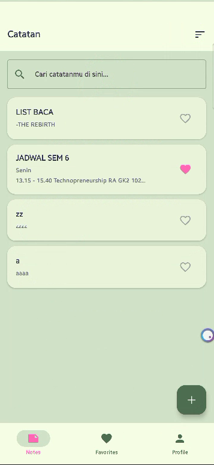
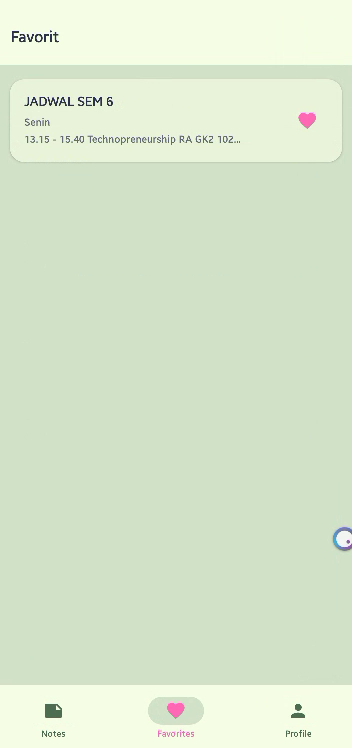
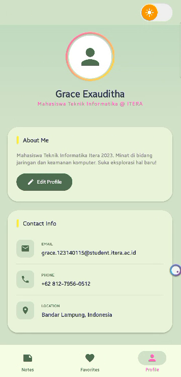
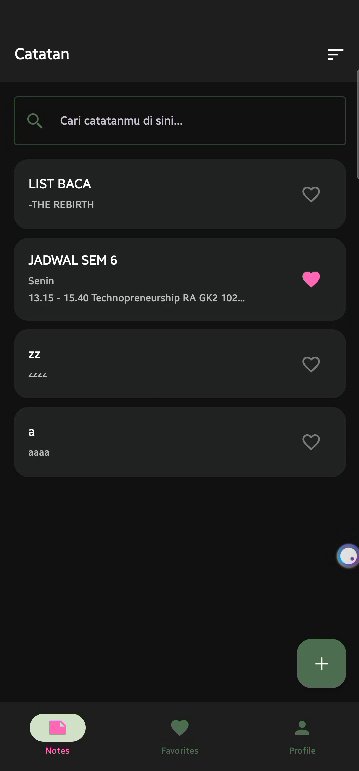
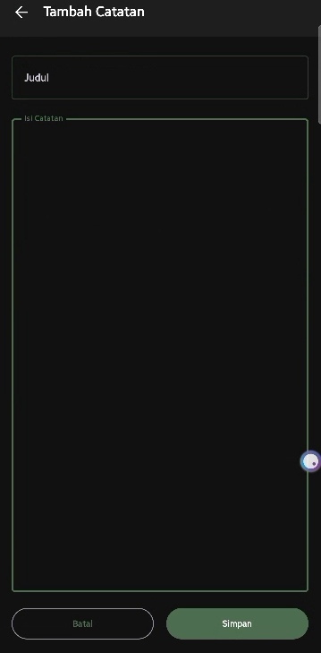
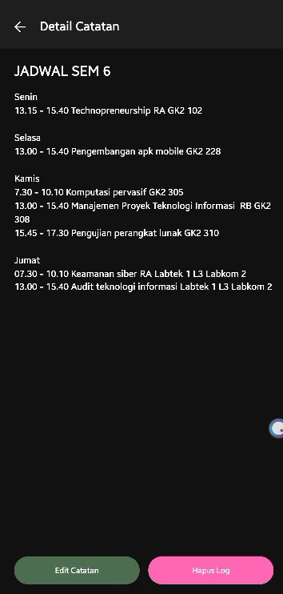

# 📓 MyNotes App — Week 7 (Final Production)

Pengembangan sistem Notes App tingkat lanjut dengan integrasi arsitektur database lokal menggunakan **SQLDelight**, manajemen preferensi persisten dengan **Jetpack DataStore**, serta fitur pencarian (*Search*) dan pengurutan (*Sorting*) secara reaktif memanfaatkan komponen *Jetpack Compose*.

---

## 👤 Identitas

| Komponen | Data |
|---|---|
| **Nama** | Grace Exauditha Nababan |
| **NIM** | 123140115 |
| **Mata Kuliah** | Pemrograman Mobile |
| **Program Studi** | Teknik Informatika - ITERA |
| **Branch / Milestone** | `week-7-final` |

---

## 📋 Deskripsi Tugas & Bobot Penilaian

Aplikasi ini mengimplementasikan arsitektur Android modern (*MVVM + Reactive Streams*) dengan rincian fitur sebagai berikut:

1. **SQLDelight Setup (20%):** Konfigurasi driver biner lokal `notes_v2.db`, pembuatan berkas `.sq` berisi skema relasional tabel, serta generator query otomatis untuk operasi database.
2. **CRUD Operations (25%):** Implementasi penuh fungsi tambah, baca, ubah, hapus catatan, serta penandaan status favorit secara persisten di penyimpanan HP.
3. **DataStore Settings (15%):** Penyimpanan preferensi pengguna (*Theme Configuration & Sorting Order*) secara asinkron menggunakan Jetpack DataStore Preferences.
4. **Search & Sort Feature (15%):** Fitur penyaringan teks realtime (*Search*) dan pengurutan dinamis (*Latest, Oldest, Alphabetical*) menggunakan operator `combine` pada Kotlin Flow.
5. **UI/UX & Code Quality (25%):** Penanganan 3 status UI (*Loading, Empty, Success*), desain bertema estetik (*Sage Green & Earth Tones*), penanganan error *NaN sRGB Color Space*, serta manajemen keamanan biner Samsung Knox Core.

---

## 🗂️ Struktur Folder

```
app/src/main/java/com/example/myprofileapp/
├── data/
│   ├── NoteRepository.kt       # Abstraksi database lokal dengan AndroidSqliteDriver
│   ├── SettingsRepository.kt   # Abstraksi preferensi dengan DataStore Preferences
│   ├── NoteUiState.kt          # Sealed interface status UI halaman daftar catatan (Loading, Empty, Success)
│   ├── ProfileUiState.kt       # Sealed interface status UI profil pengguna
│   └── Note.kt                 # Data class domain model dasar catatan
├── navigation/
│   ├── Screen.kt               # Definisi rute navigasi & Bottom Navigation Item
│   └── AppNavGraph.kt          # NavHost pengatur perpindahan argument antar-screen (onSaved/onBackClick)
├── screens/
│   ├── NoteListScreen.kt       # Daftar catatan + Komponen Search + Dropdown Sorting + FAB
│   ├── NoteDetailScreen.kt     # Detail data tunggal + Aksi Hapus Log & Navigasi Edit
│   ├── AddNoteScreen.kt        # Form masukan catatan baru dengan parameter onSaved
│   ├── EditNoteScreen.kt       # Form modifikasi catatan lama (One-time Lifecycle Gate)
│   ├── FavoritesScreen.kt      # Penampil daftar favorit via In-Memory Transformation .filter
│   └── ProfileScreen.kt        # Manajemen switch toggle Dark Mode global & data identitas
├── components/
│   └── NoteCard.kt             # Komponen visual kartu catatan reusable
├── viewmodel/
│   └── NoteViewModel.kt        # Pusat state reaktif terintegrasi operator combine Flow
├── ui/theme/
│   ├── Color.kt                # Palet warna adaptif Material 3 (Sage & Dark Mode sRGB)
│   ├── Theme.kt                # Konfigurasi bungkusan dinamis MyProfileAppTheme
│   └── Type.kt                 # Konfigurasi tipografi teks aplikasi
└── MainActivity.kt             # Entry point + Pengunci asinkron StateFlow settingsState
```

---

## 🗄️ Database Schema & Reactive Flow (SQLDelight)

Berkas skema database didefinisikan pada direktori `src/main/sqldelight/` dengan struktur entitas sebagai berikut:

```sql
CREATE TABLE noteEntity (
    id INTEGER NOT NULL PRIMARY KEY AUTOINCREMENT,
    title TEXT NOT NULL,
    content TEXT NOT NULL,
    isFavorite INTEGER NOT NULL DEFAULT 0
);

-- Queries
getAllNotes:
SELECT * FROM noteEntity;

getNoteById:
SELECT * FROM noteEntity WHERE id = ?;

insertNote:
INSERT INTO noteEntity(title, content, isFavorite) VALUES (?, ?, ?);

updateNote:
UPDATE noteEntity SET title = ?, content = ?, isFavorite = ? WHERE id = ?;

deleteNote:
DELETE FROM noteEntity WHERE id = ?;
```

### Mekanisme Penggabungan Data Reaktif (ViewModel)

Fitur Search, Sorting, dan data lokal dari SQLite digabungkan secara realtime menggunakan operator `combine` pada Kotlin Flow untuk menghindari lag pada UI Thread:

```kotlin
val notesListState: StateFlow<NoteListUiState> = combine(
    _allNotes,
    _searchQuery,
    settingsState
) { notes, query, settings ->
    var filtered = if (query.isBlank()) notes else notes.filter { it.title.contains(query, true) }
    filtered = when (settings.sortOrder) {
        "LATEST"       -> filtered.sortedByDescending { it.id }
        "OLDEST"       -> filtered.sortedBy { it.id }
        "ALPHABETICAL" -> filtered.sortedBy { it.title.lowercase() }
        else           -> filtered
    }
    NoteListUiState.Success(filtered)
}.stateIn(viewModelScope, SharingStarted.WhileSubscribed(5000), NoteListUiState.Loading)
```

---

## 🛠️ Teknologi & Dependencies

| Pustaka | Peran Arsitektur | Versi |
|---|---|---|
| **SQLDelight Android Driver** | Manajemen Database Lokal Persisten (`notes_v2.db`) | 2.0.x |
| **Jetpack DataStore Preferences** | Penyimpanan Konfigurasi Switch Dark Mode & Sort Order | 1.1.x |
| **Jetpack Compose Navigation** | Pengatur Aliran Argument Passing Antar Layar | 2.7.7 |
| **Lifecycle Compose Extensions** | Pengumpul Aliran Data Reaktif (*collectAsStateWithLifecycle*) | 2.8.7 |

### `build.gradle.kts` (Dependencies Snippet)

```kotlin
plugins {
    id("com.squareup.sqldelight") version "2.0.1"
}

dependencies {
    implementation("com.squareup.sqldelight:android-driver:2.0.1")
    implementation("androidx.datastore:datastore-preferences:1.1.1")
    implementation("androidx.navigation:navigation-compose:2.7.7")
    implementation("androidx.lifecycle:lifecycle-viewmodel-compose:2.8.7")
    implementation("androidx.lifecycle:lifecycle-runtime-compose:2.8.7")
}
```

---

## 📸 Screenshot (Full Adaptif Dark & Light Mode)

### ☀️ Tampilan Light Mode (Earth-Tone Sage Theme)

| Note List Screen                                   | Favorites                                    | Profile Settings Tab                             |
|----------------------------------------------------|----------------------------------------------|--------------------------------------------------|
|  |  |  |

### 🌙 Tampilan Full Dark Mode (Integrated DataStore Persistence)

| Note List (Dark)                                | Add Note Form (Dark)                         | Note Detail (Dark)                                 |
|-------------------------------------------------|----------------------------------------------|----------------------------------------------------|
|  |  |  |

---

## 🎬 Demo

Video demonstrasi berdurasi penuh yang membuktikan seluruh fungsionalitas fitur aplikasi (CRUD, Search Reaktif, Dropdown Sorting, Offline Mode, serta Persistence Test dari Jetpack DataStore) dapat diakses melalui tautan YouTube berikut:

🎥 **Tautan Video Demo:** https://youtube.com/shorts/cE5yH10XiP0?si=bQADHEEH6ChqE4J4

### Alur Fitur yang Didemonstrasikan:

1. **Uji DataStore (Settings):** Menyalakan tombol saklar Dark Mode di tab Profile, lalu menutup paksa aplikasi dari Recent Apps. Saat aplikasi dibuka kembali, seluruh tema tetap terkunci utuh dalam Mode Gelap secara global *(Persistence Test)*.

2. **Uji Pengurutan (Sorting):** Membuka menu Dropdown urutan di pojok kanan atas, mengubah pilihan ke "A-Z" atau "Terbaru", dan memperlihatkan susunan kartu catatan bergeser secara instan.

3. **Uji CRUD & Offline Mode:** Menambahkan catatan baru, melakukan pencarian kata kunci pada kolom Search Bar, menandai ikon hati (Favorit), mengubah isi data, hingga menghapus log catatan secara permanen di database lokal tanpa koneksi internet.